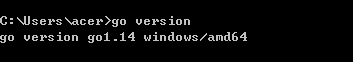
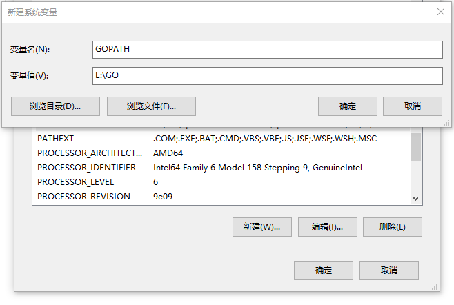
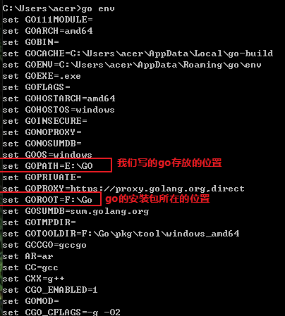
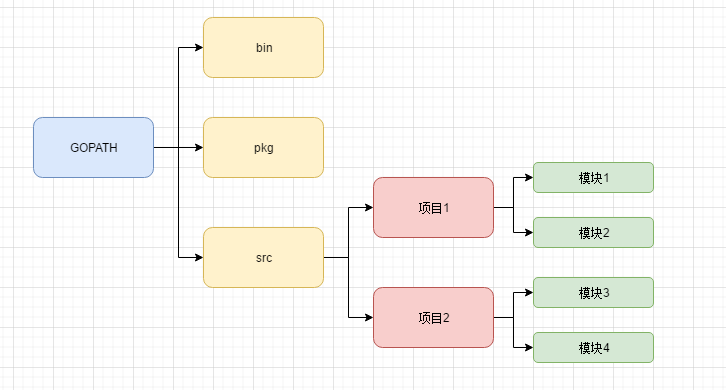
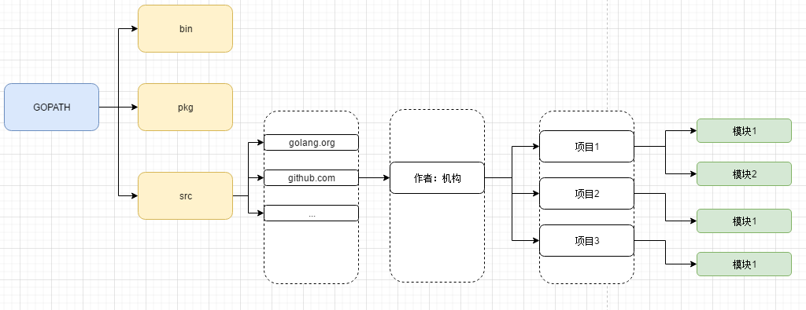
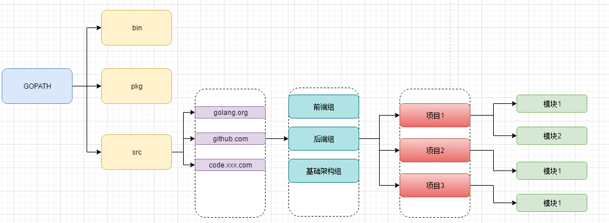
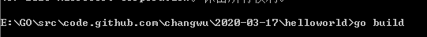
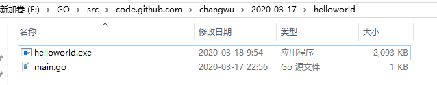
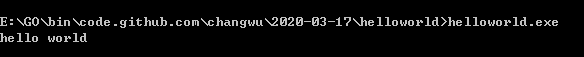
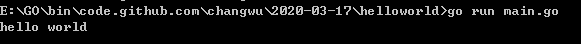

#### 一、下载安装环境:

[https://golang.google.cn](https://golang.google.cn/) 

>  自个装在了 F:/GO/ 目录下

>  练习代码放在 E:/GO/ 目录下

在cmd窗口输入  `go version` 可以看到安装的



#### 二、配置GoPath

GoPath是环境变量，告诉操作系统我们写的go项目的存放路径，此外,  GOPATH最好只添加一个,  所有的项目的代码都放在GOPATH的src目录下面。




在 GOPATH中创建如下三个目录：

* bin :    存放可执行的文件
* src ：  存放源代码
* pkg ： 存放编译的中间状态的包


如果我们将GOPATH中的bin配置进环境变量PATH中。 如果我们将编译好的二进制文件放入bin中, 在系统中的任何地方我们都能执行它


#### 三、查看配置的环境

命令： `go env`



因为我下载的Go1.14版本, 所以可以看到, 默认的包管理工具就是上面的`GO111MODULE`


#### 四、推荐的GO项目的结构


##### 4.1 个人开发者：




* bin 存放编译后的二进制文件
* pkg 存放编译后的库文件
* src  存放源文件


#####  4.2 团队开发：




比如 src下的路径是这样的： /src/github.com/changwu/layer-project

github.com表示项目托管在github上

changwu表示为用户名

lawyer为项目名


#####  4.3 企业开发者：




#### 五.  HelloWorld

##### 5.1 go build

1. 编写代码
2. 编译得到二进制可执行文件
3. 执行

GoPath:/bin/ 目录下编写代码: 

```go
package main
import fmt

func main(){
	fmt.Println("hello world")
}
```

当前代码所在目录下执行命令`go build` 会得到编译而成的二进制可执行文件



二进制文件如下：




直接运行二进制文件

 


##### 5.2  go run 

`go run XXX.go` 可以直接go文件




##### 5.3 go install

`go install`  分成两步:

1. 先编译得到一个二进制可执行文件
2. 将可执行文件拷贝到`GOPATH/bin` 

最终实现的效果就是在任何地方打开cmd控制台, 输入二进制可执行文件的名字, 都能运行这个文件


#### 六. 跨平台交叉编译

##### 6.1 在window中编译出在linux64和Mac64中可以使用的二进制文件

```bash
SET CGO_ENABLED=0   // 禁用cgo
SET GOOS=linux		// 目标平台是linux
SET GOARCH=amd64	// linux为64位
go build

SET CGO_ENABLED=0   // 禁用cgo
SET GOOS=darwin		// 目标平台是linux
SET GOARCH=amd64	// linux为64位
go build
```


##### 6.2 Mac下编译Linux和Windows平台64位可执行程序:

```bash
CGO_ENABLED=0 Goos=linux GOARCH=amd64 go build
CGO_ENABLED=0 Goos=windows GOARCH=amd64 go build
```


##### 6.3 Linux下编译Mac 和 Windows平台下64位可执行文件

```bah
CGO_ENABLED=0 Goos=darwin GOARCH=amd64 go build
CGO_ENABLED=0 Goos=windows GOARCH=amd64 go build
```


原来一直使用IDEA系列产品,   所以推荐使用GoLand,  配置简单,  使用友好


