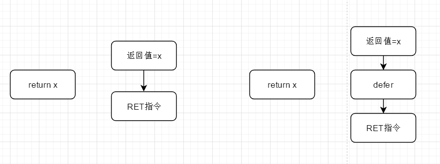

[TOC]


### 一、函数

#### 1.1 函数的定义：

```go
// 无参数，无返回值
func fun(){
    
}

// 无参数，有返回值， 并且给返回值取了名字叫 ret
func fun()(ret Type){
    
}

// 有参数，有返回值， 并且没有给返回值取名字
func sum(a int,b int) int {
    return a+b
}

// 连续参数类型相同时，可像下面这样简写
func sun (a,b int) {

}

// 有参数，有返回值， 且给返回值取了名字
func sum(a int,b int) （ret int） {
    ret = a+b
    return
}

// 多个返回值
func fun()(int,int){
    return 1,2
}
// 使用
_,v := fun()

// 可变长度的参数 , b可以接受多个int, 也能接受int类型的切片
func fun(a int,b...int){
    
}
```

#### 1.2  函数的作用域

Go中函数的作用域和Java中的作用域相当， 会被{ }限制住作用域， 局部找不到就找全局的

```go
package main
import "fmt"

var x = 100

func f1()  {
	// 删除中变量查找的顺序：
	// 1. 现在函数内部找， 找不到找函数的外部，全局的变量x
	fmt.Print(x)
}

func main() {
	f1()
}
```


#### 1.3  函数类型与作用域

通过如下例查看函数的返回值类型

```go
func f1()  {
	fmt.Print("hello f1 \n")
}

func f2() int{
	return 1
}

func f3(f func() int)(ret int){
	ret = f()
	return
}


func main() {
	a := f1
	b := f2
	
    // 查看函数的返回值类型
	fmt.Printf("%T \n",a) // 类型：func()
	fmt.Printf("%T \n",b) // 类型：func() int

	//调用
	f1() //hello f1
	// 函数也做当作参数传递
	fmt.Printf("f3：%v ",f3(f2)) //f3：1
}

```


####1.4  匿名函数

参加如下示例学习匿名函数

```go
// 声明匿名函数
// 但是一般我们都是在函数的内部申明匿名函数
var f = func ()  {

}

func main() {
	// 通常在函数的内部声明一个匿名函数
	var f1 = func() {

	}
	f1()
	f1()
	f1()

	// 如果函数仅执行一次，完全可以这样写
	func(x int){
		fmt.Print("仅会被执行一次的函数, 入参传递进来的值为：",x)
	}(1)
	
}
```


#### 1.5 内置函数

| 内置函数       | 介绍                                        |
| -------------- | ------------------------------------------- |
| close          | 主要用于关闭channel                         |
| len            | 求长度， string，array, slice, map, channel |
| new            | 分配内存， int, struct                      |
| make           | 用来分配内存， chan， map , slice           |
| append         | 向数组， slice中追加元素                    |
| panic和recover | 错误尝试恢复                                |

当出现panic时，程序会崩溃， 通过recover尝试恢复错误

**在Go中是没有try， catch这种异常处理机制来处理**

**在Go的设计哲学中， 对待每一种错误都当做是一种具体的值，应该去具体判断，具体处理， 会比较多的if-else**


参照如下的使用`recover()`的实例：

* `recover()`必须搭配defer使用
* defer+recover必须出现在 panic前面执行才有意义

```go
package main

import "fmt"

func a ()  {
	fmt.Println("a")
}

func b ()  {
	defer func() {
        // recover也不被推荐使用
		err:=recover()
		if err!=nil{
			fmt.Printf("尝试恢复错误")
		}
	}()
	panic("error panic \n")
}

func main() {
	a () // a
	b () // 尝试恢复错误
}
```


关于`fmt.Scan` 获取用户的输入

```go
func main() {
	var s string
	// 通过& 取值
	fmt.Scan(&s)
	fmt.Println(s)

	// 输入指定的格式数据
	var (
		name string
		age int
	)
	fmt.Scanf("%s %d \n",&name,&age)
	fmt.Println(name,age)

	// 可以扫描到换行
	fmt.Scanln(&name,&age)
	fmt.Println(name,age)
}
```


### 二、defer语句

#### 2.1  初识defer语句

Go 语言中的defer语句会将其后面跟随的语句进行延迟处理， 

先被defer修饰的函数最后被执行， 最后被defer修饰的函数先执行

一个函数中可以存在多个defer

defer多用于释放资源，文件句柄，数据库连接，socket连接

```go
func main(){
     fmt.Println("1")
     defer  fmt.Println("2")
     defer  fmt.Println("3")
     defer  fmt.Println("4")
     fmt.Println("5")
}
运行结果：
1
5
4
3
2
```


#### 2.2  defer的执行时机



Go的底层， return语句并不是原子操作， 分成赋值和执行RET命令两步操作

如上图为defer的执行时机


#### 2.3 defer修饰匿名函数

```go

func f1() int {
	x := 5
	defer func() {
		x++
	}()
	return x
}

func f2() (x int) {
	defer func() {
		x++
	}()
	return 5
}

func f3() (y int) {
	x := 5
	defer func() {
		x++ // 匿名函数自己没有x， 所以使用的是外部的x
	}()
	return x
}

func f4() (x int) {
	defer func(x int) {
		x++ // 这里面的x使用的就是传递给匿名函数的x
	}(x) // 将x当作参数传进去
	return 5
}

func main() {
	// 结果5， 因为他们的执行顺序为： 1.为返回值赋值  2. 执行defer 3.RET指令
	// 所以在defer之前，返回值就确定了

	fmt.Println(f1()) // 5

	/*
		第一步： 对返回值进行赋值 x=5
		第二步: defer 对x++, x=6
		第三步： 执行RET 返回6
	*/
	fmt.Println(f2()) // 6

	/*
		第一步对返回值进行赋值， 返回值是y，赋值成5
		第二步 defer对x++, 但是没有y的事
		第三步执行RET指令，返回y = 5
	*/
	fmt.Println(f3()) //5

	/*
		第一步对返回值进行赋值， 返回值是x，赋值成5
		第二步 defer 中将返回值x当成参数传递给defer匿名函数, 是值传递，传递的副本
		第三步执行RET指令，返回x = 5
	*/
	fmt.Println(f4()) //5
}
```


### 三、闭包

闭包大概率是一个函数（多数为匿名函数），这个函数可以起到适配的作用。

根据Go的作用域规定，它也能访问到它外层函数中的变量。

所以： 闭包 = 函数+外部变量的引用

参照如下的实例：

下例中，函数f3里面的匿名函数实际上就是一个闭包， 通过他实现了`main()`中的调用关系

```go
package main

import "fmt"

func f1(f2 func()) {
	fmt.Println("this is f1 will call f2")
	f2()
	fmt.Println("this is f1 finished call f2")
}

func f2(x int, y int) {
	fmt.Println("this is f2 start")
	fmt.Printf("x: %d y: %d \n", x, y)
	fmt.Println("this is f2 end")
}

// 接受一个两个参数的杉树， 返回一个包装函数
func f3(f func(int,int) ,x,y int) func() {
	fun := func() {
		f(x,y)
	}
	return fun
}

func main() {
	// 目标是实现如下的传递与调用
	f1(f3(f2,6,6))
}

// 结果
this is f1 will call f2
this is f2 start
x: 6 y: 6 
this is f2 end
this is f1 finished call f2
```

实际上底层的原理就是： 

1. 函数可以作为返回值
2. 函数中变量的查找顺序：现在自己的{}作用域中查找，再从全局范围内查找


案例：

```go
package main

import "fmt"

func calc(base int) (func(int) int, func(int)int){

	add:= func(i int) int{
		base+=i
		return base
	}

	sub:= func(i int)int {
		base-=i
		return base
	}
	return add,sub
}

func main() {
	add,sub :=calc(10)

	fmt.Println(add(1)) // 11
	fmt.Println(sub(2)) // 9 , 之所以是9, 是因为他先执行的add 将base修改成了11
}
```


