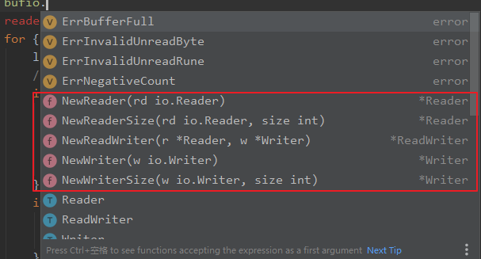

## 一. 文件读取


### 1.1 用只读的方式打开文件

示例如下, 通过`os.Open()`打开文件

```go
func main() {
	// 打开文件
	file,err:=os.Open("E:\\GO\\src\\code.github.com\\changwu\\2020-03-17\\structToJson\\test")
	if err != nil {
		fmt.Printf("error: %v\n", err)
		return
	}
	// 关闭文件
	defer file.Close()
}
```

### 1.2 读取文件

读取一次, 将文件中的内容读取到缓冲切片中

```go
func main() {
	// 打开文件
	file, err := os.Open("E:\\GO\\src\\code.github.com\\changwu\\2020-03-17\\structToJson\\test")
	if err != nil {
		fmt.Printf("error: %v\n", err)
		return
	}
	// 关闭文件
	defer file.Close()

	// 创建缓存
	var tmp = make([]byte, 128)
	// 读取文件
	num, err := file.Read(tmp)
    
	if err == io.EOF {
		fmt.Printf("error: %v\n", err)
		break
	}	
	if err != nil {
		fmt.Printf("error: %v\n", err)
		return
	}
	fmt.Printf("读取到的字节数:%v \n",num)
	fmt.Printf("读取到的内容: %v \n",string(tmp[:num]))
}

```

### 1.3 循环读取大文件

通过for循环, 循环读取 , 并将读取到的内容累加到缓存中

注意点, 最后一次读取文件时, 会发生读不到的情况, 出现 `io.EOF`的错误, 这是break出去就好

```go

func main() {
	// 打开文件
	file, err := os.Open("E:\\GO\\src\\code.github.com\\changwu\\2020-03-17\\structToJson\\test")
	if err != nil {
		fmt.Printf("error: %v\n", err)
		return
	}
	// 关闭文件
	defer file.Close()

	// 创建缓存,每次读取的大小
	var tmp = make([]byte, 128)
	// 存储文件的总大小
	var content  []byte
	for {
		// 读取文件
		num, err := file.Read(tmp)
		if err == io.EOF{
			fmt.Printf("error: %v\n", err)
			break
		}
		if err != nil {
			fmt.Printf("error: %v\n", err)
			return
		}

		content = append(content,tmp[:num]...)
	}

	fmt.Println(string(content))
}

```


### 1.4 通过bufio读取文件

Go为我们封装了带缓存的IO类,  叫做bufio



常用到上面的方法

示例如下:

```go
func main() {
	// 打开文件
	file, err := os.Open("E:\\GO\\src\\code.github.com\\changwu\\2020-03-17\\structToJson\\test")
	if err != nil {
		fmt.Printf("error: %v\n", err)
		return
	}
	// 关闭文件
	defer file.Close()
	reader := bufio.NewReader(file)
	for {
		line, err := reader.ReadString('\n')
		// 读取文件
		if err == io.EOF {
			if len(line) != 0 {
				fmt.Println(line)
			}
			break
		}
		if  err != nil {
			fmt.Printf("error: %v", err)
			return
		}
		fmt.Println(line)
	}
}

```


### 1.5 通过ioutil读取到整个文件

```go
func main() {
	// 打开文件
	data,err := ioutil.ReadFile("E:\\GO\\src\\code.github.com\\changwu\\2020-03-17\\structToJson\\test")
	if err != nil {
		fmt.Printf("error: %v\n", err)
		return
	}
	fmt.Println(string(data))
}
```


## 二. 文件写入

### 2.1 用指定的模式打开文件

`os.OpenFile()`

```go
// name : 要打开的文件名
// flag : 用什么模式打开文件
// perm : 文件的权限: r04 w02 x01
func OpenFile(name string, flag int, perm FileMode) (*File, error) {
	testlog.Open(name)
	f, err := openFileNolog(name, flag, perm)
	if err != nil {
		return nil, err
	}
	f.appendMode = flag&O_APPEND != 0

	return f, nil
}
```


打开的默认以常量的方式定义在 `os` 中

```go
const (
	// Exactly one of O_RDONLY, O_WRONLY, or O_RDWR must be specified.
	O_RDONLY int = syscall.O_RDONLY // open the file read-only.
	O_WRONLY int = syscall.O_WRONLY // open the file write-only.
	O_RDWR   int = syscall.O_RDWR   // open the file read-write.
	// The remaining values may be or'ed in to control behavior.
	O_APPEND int = syscall.O_APPEND // append data to the file when writing.
	O_CREATE int = syscall.O_CREAT  // create a new file if none exists.
	O_EXCL   int = syscall.O_EXCL   // used with O_CREATE, file must not exist.
	O_SYNC   int = syscall.O_SYNC   // open for synchronous I/O.
	O_TRUNC  int = syscall.O_TRUNC  //会直接覆盖掉源文件中的内容
)
```


### 2.2 `Write()` 和 `WriteString()`

```go
func main() {
	filePath := "E:\\GO\\src\\code.github.com\\changwu\\2020-03-17\\structToJson\\test"
	// 打开文件
	// os.O_TRUNC 截断文件, 会把源文件的内容覆盖, 没办法直接在文件中间插入新内容
	file, err := os.OpenFile(filePath,os.O_CREATE|os.O_WRONLY|os.O_APPEND, 0666)
	if err != nil {
		fmt.Printf("error: %v\n", err)
		return
	}
	defer file.Close()
	str:="hi openfile\n"
	file.Write([]byte(str))
	file.WriteString(str)
}
```


### 2.3 bufio.NewWriter()

```go
func main() {
	filePath := "E:\\GO\\src\\code.github.com\\changwu\\2020-03-17\\structToJson\\test"
	// 打开文件
	// os.O_TRUNC 截断文件, 会把源文件的内容覆盖, 没办法直接在文件中间插入新内容
	file,err:=os.OpenFile(filePath,os.O_CREATE|os.O_APPEND,0666);
	if err != nil {
		fmt.Printf("error: %v\n", err)
		return
	}
	defer file.Close()

	write:=bufio.NewWriter(file)
	// 写入缓存
	write.Write([]byte("write slice\n"))
	write.WriteString("write string\n")
	write.WriteByte('Y')
	write.WriteRune('中')
	// 注意最后要flush一下, 将缓存中的值刷新到磁盘中
	write.Flush()
}
```

###2.4` ioutil.WriteFile()`

```go
func main() {
	filePath := "E:\\GO\\src\\code.github.com\\changwu\\2020-03-17\\structToJson\\test2"
	// 打开文件
	data:="use ioutil write this data"
	err:=ioutil.WriteFile(filePath,[]byte(data),0666)
	if err != nil {
		fmt.Printf("error: %v\n", err)
		return
	}
}

```


## 三. 练习

### 3.1 使用`io.Copy()` 实现文件拷贝

```go
// 思路: 使用读取的方式打开文件
// 使用: 使用创建的方式打开目标文件
func CopyFile(targetFileName,SourceFileName string)(written int64,err error){
	sourceFile, err := os.Open(SourceFileName)
	if err != nil {
		fmt.Printf("error: %v\n", err)
		return
	}
	defer sourceFile.Close()

	targetFile, err := os.OpenFile(targetFileName, os.O_CREATE|os.O_WRONLY, 0666)
	if err != nil {
		fmt.Printf("error: %v\n", err)
		return
	}
	defer targetFile.Close()

	return io.Copy(targetFile,sourceFile)
}

func main() {
	filePath2 := "E:\\GO\\src\\code.github.com\\changwu\\2020-03-17\\structToJson\\test2"
	filePath3 := "E:\\GO\\src\\code.github.com\\changwu\\2020-03-17\\structToJson\\test3"
	// 打开文件
	_, err := CopyFile(filePath3, filePath2)
	if err != nil {
		fmt.Printf("error: %v\n", err)
		return
	}
	fmt.Println("done")
}
```


